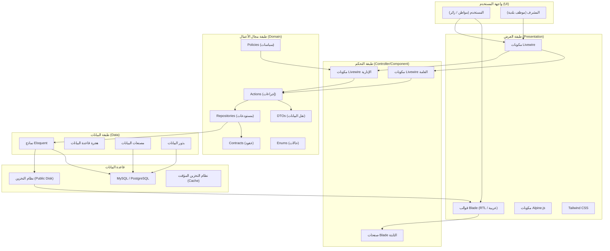
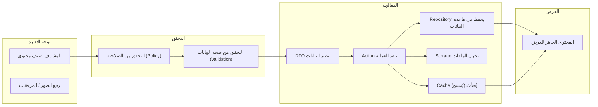
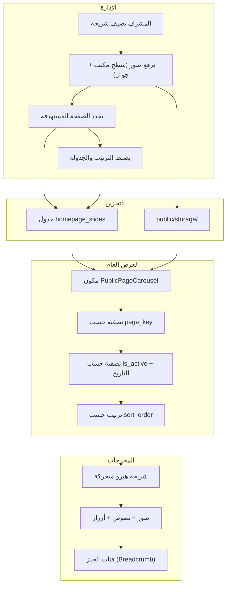

> **Document Type:** System Presentation & Product Overview  
> **Prepared:** 25 يوليو 2026  
> **Version:** 1.0  
> **Project:** بوابة بلدية إذنا الرقمية — Idna Municipality Digital Portal

---

# 🏛️ بوابة بلدية إذنا الرقمية  
## Idna Municipality Digital Portal

### منصة رقمية متكاملة لإدارة المحتوى البلدي والخدمات الإلكترونية  
An Integrated Digital Content Management and E-Services Platform

---

**مقدم إلى:**  
إدارة بلدية إذنا  
مجلس بلدي إذنا  
فريق التطوير التقني

**تاريخ التقديم:** 25 يوليو 2026  
**النسخة:** Presentation v1.0  
**الحالة:** قيد التشغيل والتطوير المستمر

---

# 1. ملخص تنفيذي — Executive Summary

**بوابة بلدية إذنا الرقمية** هي منصة متكاملة ومبنية وفق أحدث معايير تطوير تطبيقات الويب، تهدف إلى توفير قناة رقمية موحدة بين بلدية إذنا والمواطنين. لا تقتصر المنصة على كونها موقعًا إلكترونيًا عاديًا، بل هي نظام متكامل لإدارة المحتوى البلدي والخدمات الإلكترونية، يمكّن الموظفين من التحكم الكامل بالمحتوى دون الحاجة إلى تدخل تقني، ويمنح المواطنين وصولاً سهلاً وسريعاً للمعلومات والخدمات.

### المشكلات التي تحلها المنصة:

| المشكلة | الحل الرقمي |
|---------|------------|
| صعوبة الوصول إلى معلومات البلدية | بوابة رقمية موحدة تعمل 24/7 |
| تأخر نشر الإعلانات والقرارات | نظام نشر فوري مع إشعارات عاجلة |
| تعدد قنوات التواصل مع البلدية | مركز معلومات متكامل مع جميع جهات الاتصال |
| صعوبة متابعة الوظائف والإعلانات | محرك بحث وتصفية متقدم |
| عدم وجود سجل رقمي للقرارات | أرشيف إلكتروني متكامل للقرارات البلدية |
| ضعف الشفافية في معلومات المجلس البلدي | عرض كامل لأعضاء المجلس وقراراتهم |
| عدم وجود منصة موحدة للخدمات | بوابة خدمات إلكترونية مصنفة حسب الفئة |
| صعوبة متابعة مواعيد توزيع المياه | جدول توزيع مياه تفاعلي محدث يومياً |

### من يستخدم المنصة:

- **المواطنون:** تصفح الخدمات، متابعة الإعلانات، البحث عن وظائف، الاطلاع على قرارات المجلس
- **موظفو البلدية:** إدارة المحتوى البلدي، تحديث البيانات، نشر الإعلانات
- **المشرفون:** إدارة الصلاحيات، متابعة الأداء، التقارير
- **المكاتب الهندسية:** تحديث بياناتها وعرضها للجمهور
- **إدارة البلدية:** متابعة المؤشرات والإحصائيات عبر لوحة القيادة

### ما يميز المنصة عن المواقع التقليدية:

- نظام إدارة محتوى متكامل (CMS) مع تحكم كامل بصلاحيات المستخدمين
- واجهة إدارية متطورة مع لوحة قيادة تنفيذية
- نظام إعلانات متقدم مع أنواع وأولويات متعددة
- بوابة خدمات إلكترونية مع تحليلات الزوار
- نظام كاروسيل (شريط متحرك) مركزي لجميع صفحات الموقع
- بنية Domain-Driven Design قابلة للتوسع
- دعم كامل للغة العربية والاتجاه RTL
- تصميم متجاوب مع جميع الأجهزة

---

# 2. رؤية المنصة — Platform Vision

### التحول الرقمي — Digital Transformation

تأتي المنصة كجزء من استراتيجية بلدية إذنا للتحول الرقمي، حيث تنتقل الخدمات والمعلومات من القنوات التقليدية (المكاتب، الهاتف، الإعلانات الورقية) إلى منصة رقمية واحدة متاحة على مدار الساعة.

### الخدمة الذاتية للمواطنين — Citizen Self-Service

تمكين المواطنين من الوصول إلى المعلومات، تصفح الخدمات، البحث عن الوظائف، ومتابعة الإعلانات والقرارات البلدية دون الحاجة إلى زيارة مقر البلدية.

### الشفافية — Transparency

نشر قرارات المجلس البلدي، أعضاء المجلس، معلومات الاتصال، وبيانات البلدية بشكل مفتوح وشفاف يعزز الثقة بين المواطنين والإدارة.

### إدارة محتوى مركزية — Centralized Content Management

تمكين فريق واحد من إدارة جميع محتويات المنصة من خلال واجهة إدارية موحدة، مع نظام صلاحيات متكامل يضمن التحكم بمن يمكنه إنشاء وتحرير ونشر كل نوع من المحتوى.

### وصول أسرع للخدمات — Faster Access to Services

تصنيف الخدمات الإلكترونية حسب الفئات وتوفير محرك بحث متقدم يتيح للمواطنين الوصول إلى الخدمة المطلوبة بسرعة.

### تواصل أفضل مع الجمهور — Better Public Communication

نظام إعلانات متكامل يدعم الإعلانات العاجلة والهامة والعادية، مع إمكانية تمييز الإعلانات المهمة بلون وشريط تحذيري أعلى الموقع.

### تجربة متجاوبة مع الجوال — Mobile Accessibility

تصميم متجاوب بالكامل مع جميع أحجام الشاشات، مع صور متخصصة للجوال في نظام الكاروسيل.

### توسع مستقبلي مستدام — Sustainable Future Expansion

بنية DDD (Domain-Driven Design) تسمح بإضافة وحدات جديدة بسهولة دون التأثير على الوحدات الحالية، مما يجعل المنصة قابلة للتوسع بشكل لا نهائي.

---

# 3. المستخدمون المستهدفون — Target Users

| فئة المستخدم | الاحتياجات | الوحدات المرتبطة |
|-------------|-----------|-----------------|
| **المواطنون** | تصفح الخدمات، الاطلاع على الإعلانات، متابعة الوظائف، جدول المياه، معلومات البلدية | جميع الوحدات العامة |
| **موظفو البلدية** | إدارة المحتوى البلدي، تحديث البيانات، متابعة طلبات المواطنين | لوحة التحكم، إدارة المحتوى |
| **مشرفو النظام** | إدارة المستخدمين والصلاحيات، متابعة النظام، إعدادات المنصة | إدارة المستخدمين والأدوار، الإعدادات |
| **رؤساء الأقسام** | إدارة محتوى قسمهم، متابعة الموظفين، التقارير | لوحة التحكم، الأقسام |
| **المقاولون والمكاتب الهندسية** | عرض بياناتهم للجمهور، تحديث معلومات الترخيص | المكاتب الهندسية |
| **باحثو البيانات** | الاطلاع على البيانات المفتوحة | البيانات المفتوحة (Open Data) |
| **زوار الموقع** | تصفح المحتوى العام، التواصل مع البلدية | جميع الوحدات العامة |

---

# 4. تجربة البوابة العامة — Public Portal Experience

### هيكل الموقع العام

```
                 ┌─────────────────────────────────────┐
                 │            الشريط العلوي             │
                 │  الشعار  |  القائمة  |  تسجيل دخول  │
                 └─────────────────────────────────────┘
                 ┌─────────────────────────────────────┐
                 │        شريط الإعلانات العاجلة        │
                 └─────────────────────────────────────┘
                 ┌─────────────────────────────────────┐
                 │        شريط الهيرو المتحرك           │
                 └─────────────────────────────────────┘
                 ┌─────────────────────────────────────┐
                 │             المحتوى الرئيسي          │
                 │   (حسب الوحدة المختارة)              │
                 └─────────────────────────────────────┘
                 ┌─────────────────────────────────────┐
                 │              التذييل                 │
                 │  معلومات الاتصال  |  الروابط  |  ™   │
                 └─────────────────────────────────────┘
```

### القائمة الرئيسية — Navigation

تتضمن القائمة العامة روابط لجميع الوحدات العامة:
- الرئيسية
- الخدمات الإلكترونية
- الدوائر البلدية
- المرافق العامة
- الإعلانات
- الوظائف
- المجلس البلدي (الأعضاء + القرارات)
- المكاتب الهندسية
- جدول توزيع المياه
- البيانات المفتوحة
- معلومات عن البلدية

### صفحة البداية (الرئيسية) — Homepage

تتكون الصفحة الرئيسية من الأقسام التالية مرتبة حسب الترتيب الظاهر:

1. **شريط الإعلانات العاجلة** — شريط أحمر متحرك أعلى الصفحة يعرض آخر الإعلانات العاجلة المنشورة
2. **شريط الهيرو (الكاروسيل)** — شرائح متحركة مع زرين للتفاعل (أساسي وثانوي)
3. **الروابط السريعة** — أيقونات وصول سريع للخدمات والصفحات الأساسية
4. **الخدمات الإلكترونية** — عرض الخدمات المميزة مع تصنيفاتها
5. **الدوائر البلدية** — عرض الدوائر المميزة
6. **المرافق العامة** — عرض المرافق العامة المميزة
7. **نبذة عن البلدية** — معلومات البلدية، ساعات العمل، جهات الطوارئ
8. **أعضاء المجلس البلدي** — عرض أعضاء المجلس المميزين
9. **قرارات المجلس البلدي** — أحدث القرارات
10. **جدول توزيع المياه** — حالة التوزيع اليومية
11. **الوظائف والمكاتب الهندسية** — أحدث الوظائف والمكاتب الهندسية
12. **آخر الأخبار** — (قيد التطوير — يعرض رسالة "قريباً")
13. **فيسبوك** — خلاصة صفحة الفيسبوك
14. **الإحصائيات** — إحصائيات البلدية (تلقائية + يدوية)
15. **الشركاء** — شعارات الشركاء
16. **تواصل معنا** — قسم التواصل مع الروابط وجهات الاتصال

### الخدمات الإلكترونية — Electronic Services

بوابة متكاملة للخدمات البلدية مصنفة حسب الفئات:
- تصفح جميع الخدمات مع إمكانية البحث والتصفية حسب القسم
- عرض تفاصيل الخدمة (الشروط، المستندات المطلوبة، الخطوات، الرسوم)
- روابط مباشرة لبوابات الخدمات الخارجية
- تتبع المشاهدات والنقرات على البوابات الخارجية
- **ملاحظة:** الخدمات حالياً معلوماتية — لا يوجد تقديم إلكتروني للطلبات عبر المنصة

### الدوائر البلدية — Departments

- عرض جميع الدوائر البلدية مع معلومات الاتصال
- عرض تفاصيل الدائرة (الرؤية، الرسالة، المسؤوليات، ساعات العمل)
- إمكانية تمييز الدوائر المميزة

### المرافق العامة — Public Facilities

- عرض المرافق العامة مصنفة حسب الفئات
- تفاصيل المرفق (الخدمات، المميزات، القواعد، العنوان، ساعات العمل)
- معرض صور للمرفق

### الإعلانات — Announcements

- عرض جميع الإعلانات المنشورة مع إمكانية البحث والتصفية حسب النوع والأولوية
- أنواع الإعلانات: عام، إشعار مهم، طارئ، انقطاع خدمة، إشعار مياه، إغلاق طريق، دعوة عامة، مناقصة، فعالية، أخرى
- الأولويات: عادي، مهم، عاجل
- عرض الإعلانات المميزة في صف منفصل
- صفحة تفاصيل الإعلان مع الكاروسيل والصورة والمحتوى الكامل

### الوظائف — Jobs

- عرض الوظائف المتاحة مع إمكانية التصفية حسب النوع والقسم
- تفاصيل الوظيفة (المتطلبات، المسؤوليات، المزايا، طريقة التقديم)
- الوظائف المنتهية أو المغلفة لا تظهر للجمهور

### المجلس البلدي — Council

- **أعضاء المجلس:** عرض جميع الأعضاء مع صورهم وبياناتهم ولجانهم
- **قرارات المجلس:** عرض القرارات المنشورة مع إمكانية البحث والتصفية حسب النوع والسنة
- تفاصيل القرار الكامل مع المرفقات

### المكاتب الهندسية — Engineering Offices

- عرض المكاتب الهندسية المعتمدة مع إمكانية البحث
- تفاصيل المكتب (المهندس المسؤول، التخصصات، الترخيص، بيانات الاتصال)
- إظهار المكاتب المعتمدة والنشطة فقط

### جدول توزيع المياه — Water Schedule

- عرض جدول توزيع المياه اليومي
- اختيار المنطقة لعرض الجدول الخاص بها
- إشعارات الصيانة النشطة

### البيانات المفتوحة — Open Data

- عرض البيانات المتاحة للتحميل
- إمكانية البحث والتصفية حسب النوع

### صفحة معلومات عن البلدية — About

- معلومات عامة عن بلدية إذنا
- الرؤية والرسالة والأهداف
- بيانات التأسيس والسكان والمساحة والإحداثيات

---

# 5. الصفحة الرئيسية — Homepage Presentation

### الأقسام الفعلية للصفحة الرئيسية (بالترتيب الفعلي للظهور):

| الترتيب | القسم | المصدر | الإدارة | ملاحظات |
|---------|-------|--------|---------|---------|
| 0 | شريط الإعلانات العاجلة | Announcement (urgent + published) | لوحة الإعلانات | شريط أحمر متحرك، قابل للإغلاق |
| 1 | شريط الهيرو المتحرك | HomepageSlide (page_key='home') | لوحة الكاروسيل | صور ديسكتوب + جوال، أزرار تفاعلية |
| 2 | الروابط السريعة | HomepageQuickLink | لوحة الصفحة الرئيسية | أيقونات، روابط داخلية/خارجية |
| 3 | الخدمات الإلكترونية | ElectronicService (featured) | لوحة الخدمات | 6 خدمات كحد أقصى |
| 4 | الدوائر البلدية | Department (featured) | لوحة الدوائر | 6 دوائر كحد أقصى |
| 5 | المرافق العامة | Facility (published) | لوحة المرافق | 4 مرافق كحد أقصى |
| 6 | نبذة عن البلدية | Municipality + Media | لوحة البلدية | شعار، جهات اتصال، ساعات دوام |
| 7 | أعضاء المجلس البلدي | CouncilMember (featured) | لوحة المجلس | 6 أعضاء كحد أقصى |
| 8 | قرارات المجلس البلدي | CouncilDecision (published) | لوحة القرارات | 8 قرارات كحد أقصى |
| 9 | جدول توزيع المياه | WaterSchedule (today) | لوحة المياه | جدول تفاعلي حسب المنطقة |
| 10 | الوظائف والمكاتب الهندسية | Job (published) + EngineeringOffice | لوحة الوظائف والمكاتب | 3 وظائف + جميع المكاتب |
| 11 | آخر الأخبار | — (placeholder) | — | يعرض "قريباً" (قيد التطوير) |
| 12 | خلاصة فيسبوك | Facebook embed | — | مضمنة دائماً |
| 13 | الإحصائيات | HomepageStatistic + Auto | لوحة الإحصائيات | إحصائيات يدوية + تلقائية |
| 14 | الشركاء | Media (partner_logo) | لوحة الوسائط | شعارات الشركاء |
| 15 | تواصل معنا | من إعدادات البلدية | لوحة البلدية | CTA مع معلومات الاتصال |

### آلية التحكم:

يمكن للمشرف التحكم بكل قسم من خلال:
- تفعيل/إلغاء تفعيل القسم
- تغيير ترتيب الأقسام
- تحديد عدد العناصر المعروضة
- كل قسم له إعداداته الخاصة المخزنة في جدول `homepage_sections`

---

# 6. الخدمات الإلكترونية — Electronic Services

### نظرة عامة

بوابة الخدمات الإلكترونية هي وحدة متكاملة تتيح للمواطنين تصفح جميع الخدمات التي تقدمها بلدية إذنا، مصنفة حسب الفئات.

### فئات الخدمات

تتضمن المنصة **8 فئات رئيسية** مع **26 خدمة إلكترونية** كبيانات أولية:
- رخص البناء (6 خدمات)
- الشؤون الإدارية (5 خدمات)
- الشؤون القانونية (3 خدمات)
- الخدمات الصحية (4 خدمات)
- الخدمات المالية (3 خدمات)
- الخدمات الاجتماعية (2 خدمات)
- الخدمات البيئية (3 خدمات)
- الخدمات التخطيطية (2 خدمات)

### المميزات

- **تصفح حسب الفئة:** عرض الخدمات مصنفة ضمن فئات ذات تسلسل هرمي (فئات رئيسية + فرعية)
- **بحث متقدم:** بحث بالاسم والوصف
- **تصفية:** حسب القسم، الخدمات المميزة، الخدمات التي تتطلب تسجيل دخول
- **صفحة تفاصيل الخدمة:** تحتوي على الشروط، المستندات المطلوبة، خطوات التقديم، الرسوم، مدة المعالجة
- **الخدمات ذات الصلة:** عرض خدمات مشابهة في نفس الفئة
- **رابط البوابة الخارجية:** زر مباشر لبوابة التقديم الخارجية (عند وجودها)
- **تتبع المشاهدات:** تسجيل عدد مرات مشاهدة كل خدمة
- **تتبع النقرات:** تسجيل عدد النقرات على روابط البوابات الخارجية
- **تحليلات الخدمات:** إحصائيات متقدمة لأكثر الخدمات مشاهدة ونقراً

### لوحة الإدارة

- إضافة وتحرير وحذف فئات الخدمات
- إضافة وتحرير وحذف الخدمات
- صلاحيات منفصلة: مشاهدة، إنشاء، تحديث، حذف، نشر، تمييز
- تحليلات الخدمات (الأكثر مشاهدة، الأكثر نقراً، حسب الفئة)
- نظام نشر (مسودة/منشور/مؤرشف)

### ملاحظة هامة

الخدمات حالياً **معلوماتية** — تعرض معلومات عن الخدمة والشروط والمستندات المطلوبة. لا تشمل المنصة حالياً تقديم الطلبات إلكترونياً أو الدفع الإلكتروني. هذه الميزات متاحة للتنفيذ المستقبلي.

---

# 7. وحدات المحتوى البلدي — Municipality Content Modules

## 7.1 الدوائر البلدية — Departments

| الجانب | التفاصيل |
|--------|---------|
| **ما يراه المواطن** | صفحة عرض جميع الدوائر مع بطاقات لكل دائرة تحتوي على الاسم، صورة الغلاف، مدير الدائرة، ملخص، أيقونة. صفحة تفاصيل لكل دائرة تحتوي على معلومات الاتصال، الرؤية، الرسالة، المسؤوليات، ساعات العمل. |
| **الإدارة** | إضافة، تعديل، حذف الدوائر. تعيين مدير الدائرة، رفع صورة غلاف، تفعيل/إلغاء تفعيل الظهور للجمهور، تمييز الدائرة. |
| **البحث والتصفية** | بحث بالاسم والوصف، تصفية حسب الحالة |
| **الوسائط** | أيقونة (مسار نصي)، صورة غلاف (رفع ملف) |
| **حالة النشر** | نشط/غير نشط، عام/غير عام، مميز/غير مميز |
| **الاختبارات** | 12 اختبار |
| **الحالة** | ✅ مكتملة |

## 7.2 المرافق العامة — Public Facilities

| الجانب | التفاصيل |
|--------|---------|
| **ما يراه المواطن** | صفحة عرض جميع المرافق مصنفة حسب الفئات مع بحث وتصفية. صفحة تفاصيل لكل مرفق تحتوي على صورة الغلاف، معرض صور، الخدمات، المميزات، القواعد، العنوان، ساعات العمل، بيانات الاتصال. |
| **الإدارة** | إضافة وتحرير وحذف فئات المرافق والمرافق نفسها. رفع صور الغلاف، إضافة معرض صور، إدارة الخدمات والمميزات والقواعد لكل مرفق. |
| **البحث والتصفية** | بحث بالاسم والوصف، تصفية حسب الفئة |
| **الوسائط** | صورة غلاف، معرض صور (مصفوفة JSON)، أيقونة للفئة |
| **حالة النشر** | مسودة، منشور، مؤرشف. عام/غير عام. مميز/غير مميز. |
| **الاختبارات** | 13 اختبار |
| **الحالة** | ✅ مكتملة |

## 7.3 أعضاء المجلس البلدي — Council Members

| الجانب | التفاصيل |
|--------|---------|
| **ما يراه المواطن** | صفحة عرض جميع الأعضاء مع صورهم وبياناتهم. صفحة تفاصيل لكل عضو تحتوي على السيرة الذاتية، المؤهلات، اللجان، معلومات الاتصال، روابط التواصل الاجتماعي. |
| **الإدارة** | إضافة وتحرير وحذف الأعضاء. رفع الصور الشخصية. تعيين المنصب، اللجنة، المدة. تفعيل/إلغاء التفعيل للجمهور. |
| **البحث والتصفية** | بحث بالاسم والمنصب |
| **الوسائط** | صورة شخصية (رفع ملف) |
| **حالة النشر** | نشط/غير نشط. عام/غير عام. مميز/غير مميز. |
| **الاختبارات** | ضمن اختبارات المجلس |
| **الحالة** | ✅ مكتملة |

## 7.4 قرارات المجلس البلدي — Council Decisions

| الجانب | التفاصيل |
|--------|---------|
| **ما يراه المواطن** | صفحة عرض القرارات المنشورة مع بحث وتصفية حسب النوع والسنة. صفحة تفاصيل لكل قرار تحتوي على المحتوى الكامل، رقم القرار، تاريخه، رقم الجلسة. إمكانية التنقل بين القرارات السابقة والتالية. |
| **الإدارة** | إضافة وتحرير وحذف القرارات. رفع ملفات مرفقة. نشر، أرشفة، إلغاء القرارات. |
| **البحث والتصفية** | بحث بالرقم والعنوان، تصفية حسب النوع والسنة |
| **الوسائط** | ملف مرفق (PDF/صورة) |
| **حالة النشر** | مسودة، منشور، ملغي، مؤرشف. عام/غير عام. |
| **الاختبارات** | 13 + 22 = 35 اختبار |
| **الحالة** | ✅ مكتملة |

## 7.5 المكاتب الهندسية — Engineering Offices

| الجانب | التفاصيل |
|--------|---------|
| **ما يراه المواطن** | صفحة عرض المكاتب الهندسية المعتمدة مع إمكانية البحث. صفحة تفاصيل لكل مكتب تحتوي على المهندس المسؤول، رقم الترخيص، التخصصات، بيانات الاتصال. |
| **الإدارة** | إضافة وتحرير وحذف المكاتب. اعتماد، تعليق، تمييز. متابعة تواريخ انتهاء الترخيص. |
| **البحث والتصفية** | بحث باسم المكتب أو المهندس |
| **الوسائط** | تخصصات (JSON)، لا يدعم الصور حالياً |
| **حالة النشر** | معلق، نشط، منتهي. معتمد/غير معتمد. عام/غير عام. |
| **الاختبارات** | 9 اختبارات |
| **الحالة** | ✅ مكتملة |

## 7.6 جدول توزيع المياه — Water Schedule

| الجانب | التفاصيل |
|--------|---------|
| **ما يراه المواطن** | صفحة تفاعلية لعرض جدول توزيع المياه اليومي. اختيار المنطقة لعرض الجدول الخاص بها. إشعارات الصيانة النشطة. |
| **الإدارة** | إدارة المناطق (إضافة، تعديل، حذف). إدارة جداول التوزيع اليومية مع إمكانية نسخ جدول اليوم السابق. إدارة الصيانة الدورية. نشر الجداول للجمهور. |
| **البحث والتصفية** | اختيار المنطقة من قائمة منسدلة |
| **الوسائط** | لا يدعم الوسائط |
| **حالة النشر** | جداول: متاح، ضغط منخفض، صيانة، طارئ، لا يوجد مياه. عام/غير عام. |
| **الاختبارات** | 17 + 6 = 23 اختبار |
| **الحالة** | ✅ مكتملة |

## 7.7 الوظائف — Jobs

| الجانب | التفاصيل |
|--------|---------|
| **ما يراه المواطن** | صفحة عرض الوظائف المتاحة مع بحث وتصفية حسب النوع والقسم. صفحة تفاصيل لكل وظيفة تحتوي على المتطلبات، المسؤوليات، المزايا، طريقة التقديم، المرفقات. |
| **الإدارة** | إضافة وتحرير وحذف الوظائف. رفع ملفات مرفقة. نشر، إغلاق، أرشفة، تمييز. |
| **البحث والتصفية** | بحث بالعنوان، تصفية حسب نوع التوظيف ونوع التقديم |
| **الوسائط** | ملف مرفق (PDF/Word) |
| **حالة النشر** | مسودة، منشور، مغلق، مؤرشف. عام/غير عام. مميز/غير مميز. |
| **الاختبارات** | 14 اختبار |
| **الحالة** | ✅ مكتملة |

## 7.8 الإعلانات — Announcements

| الجانب | التفاصيل |
|--------|---------|
| **ما يراه المواطن** | صفحة عرض الإعلانات المنشورة مع بحث وتصفية حسب النوع والأولوية. إعلانات مميزة في صف منفصل. صفحة تفاصيل لكل إعلان تحتوي على الصورة، المحتوى الكامل، التصنيفات، إعلانات ذات صلة. |
| **الإدارة** | إضافة وتحرير وحذف الإعلانات. رفع الصور. نشر، إلغاء النشر، تمييز. |
| **البحث والتصفية** | بحث بالعنوان، تصفية حسب النوع والأولوية والترتيب |
| **الوسائط** | صورة (desktop only حالياً — mobile_image_path موجود في المايجريشن لكن لم يُطبق بعد) |
| **حالة النشر** | مسودة، منشور، مؤرشف. مميز/غير مميز. |
| **الاختبارات** | 23 اختبار |
| **قيود حالية** | لا توجد أعمدة `starts_at`/`ends_at` في قاعدة البيانات بعد. لا توجد صور جوال أو مرفقات أو روابط خارجية. |
| **الحالة** | ✅ مكتملة مع قيود بسيطة |

## 7.9 البيانات المفتوحة — Open Data

| الجانب | التفاصيل |
|--------|---------|
| **ما يراه المواطن** | صفحة عرض البيانات المتاحة مع بحث وتصفية حسب النوع |
| **الإدارة** | لا توجد لوحة إدارة بعد. البيانات حالياً تعتمد على المستودع (Repository) الموجود. |
| **البحث والتصفية** | بحث + تصفية حسب النوع |
| **الوسائط** | لا يدعم الوسائط |
| **الحالة** | ⚠️ جزئية — تعمل على مستوى العرض العام مع مستودع بيانات أساسي، لكن لا توجد واجهة إدارة لإضافة البيانات |

## 7.10 معلومات البلدية — Municipality About

| الجانب | التفاصيل |
|--------|---------|
| **ما يراه المواطن** | صفحة معلومات شاملة عن بلدية إذنا: الرؤية، الرسالة، الأهداف، تاريخ التأسيس، السكان، المساحة، الموقع |
| **الإدارة** | إدارة المعلومات العامة، جهات الاتصال، وسائل التواصل الاجتماعي، المنصات الخارجية، الحقول المخصصة، الوسائط، ساعات العمل، جهات الطوارئ |
| **الحالة** | ✅ مكتملة |

---

# 8. نظام الكاروسيل المركزي — Centralized Page Carousel System

### نظرة عامة

نظام الكاروسيل المركزي هو أحد أكثر المميزات تطوراً في المنصة. يسمح بإدارة جميع الشرائح المتحركة (Hero Slides) لجميع صفحات الموقع من واجهة إدارية واحدة.

### آلية العمل

```
       ┌─────────────────────────────────────┐
       │         لوحة إدارة الكاروسيل         │
       │  (إضافة / تعديل / حذف / ترتيب)       │
       └──────────────┬──────────────────────┘
                      │
                      ▼
       ┌─────────────────────────────────────┐
       │         جدول homepage_slides         │
       │  page_key: أي صفحة تنتمي إليها الشريحة │
       │  image_path: صورة سطح المكتب           │
       │  mobile_image_path: صورة الجوال        │
       │  is_active, sort_order, dates         │
       └──────────────┬──────────────────────┘
                      │
                      ▼
       ┌─────────────────────────────────────┐
       │    PublicPageCarousel Component      │
       │  تصفية حسب page_key + is_active      │
       │  تصفية حسب تاريخ البداية والنهاية    │
       │  ترتيب حسب sort_order                 │
       └──────────────┬──────────────────────┘
                      │
                      ▼
       ┌─────────────────────────────────────┐
       │    public-page-carousel.blade.php    │
       │  عرض الشريحة مع النص والصور والأزرار │
       └─────────────────────────────────────┘
```

### الصفحات المدعومة

| المفتاح | الصفحة | حالة الكاروسيل |
|---------|--------|---------------|
| `home` | الصفحة الرئيسية | ✅ نشط |
| `about` | عن البلدية | 🔲 متاح (بدون شريحة افتراضية) |
| `services` | الخدمات الإلكترونية | ✅ شريحة افتراضية موجودة |
| `departments` | الدوائر البلدية | ✅ شريحة افتراضية موجودة |
| `facilities` | المرافق العامة | ✅ شريحة افتراضية موجودة |
| `jobs` | الوظائف | ✅ شريحة افتراضية موجودة |
| `announcements` | الإعلانات | 🔲 متاح (بدون شريحة افتراضية) |
| `council-decisions` | قرارات المجلس | 🔲 متاح (بدون شريحة افتراضية) |
| `council-members` | أعضاء المجلس | 🔲 متاح (بدون شريحة افتراضية) |
| `engineering-offices` | المكاتب الهندسية | ✅ شريحة افتراضية موجودة |
| `open-data` | البيانات المفتوحة | ✅ شريحة افتراضية موجودة |
| `water-schedule` | جدول المياه | ✅ شريحة افتراضية موجودة |

### مميزات النظام

- **إدارة مركزية:** جميع الشرائح من لوحة تحكم واحدة
- **صور مخصصة:** دعم صور منفصلة لسطح المكتب والجوال
- **جدولة زمنية:** تحديد تاريخ بداية ونهاية لكل شريحة
- **تفعيل/إلغاء تفعيل:** تحكم كامل بظهور كل شريحة
- **ترتيب:** ترتيب الشرائح حسب الأولوية
- **شعارات ونصوص:** عنوان، عنوان فرعي، وصف، شارة
- **أزرار تفاعلية:** زر أساسي وزر ثانوي مع روابط
- **فتات الخبز (Breadcrumb):** مسار التنقل يتم توليده تلقائياً حسب الصفحة

### الصور والوسائط

- **صورة سطح المكتب:** `image_path` — مخزنة في `storage/app/public/`
- **صورة الجوال:** `mobile_image_path` — مخزنة في `storage/app/public/`
- **صور افتراضية:** عند عدم وجود صورة، تعرض الشريحة بدون خلفية (تستخدم ألوان التدرج)

---

# 9. إعلانات البلدية — Municipality Announcements

### نظرة عامة

وحدة الإعلانات هي نظام متكامل لنشر وإدارة جميع أنواع الإعلانات والتنبيهات البلدية، مع دعم التصنيف حسب النوع والأولوية، وخيارات النشر والتمييز والعرض على الصفحة الرئيسية.

### أنواع الإعلانات

| النوع (عربي) | النوع (إنجليزي) | الرمز |
|-------------|----------------|-------|
| عام | General | `general` |
| إشعار مهم | Important Notice | `important_notice` |
| طارئ | Emergency | `emergency` |
| انقطاع خدمة | Service Interruption | `service_interruption` |
| إشعار مياه | Water Notice | `water_notice` |
| إغلاق طريق | Road Closure | `road_closure` |
| دعوة عامة | Public Invitation | `public_invitation` |
| مناقصة | Tender Notice | `tender_notice` |
| فعالية | Event | `event` |
| أخرى | Other | `other` |

### أولويات الإعلانات

| الأولوية (عربي) | الأولوية (إنجليزي) | التأثير |
|----------------|-------------------|---------|
| عادي | Normal | يظهر في قائمة الإعلانات فقط |
| مهم | Important | يتم تمييزه في القائمة بلون خاص |
| عاجل | Urgent | يظهر في الشريط العاجل أعلى الموقع + تمييز خاص |

### حالة النشر

- **مسودة (Draft):** لا تظهر للجمهور
- **منشور (Published):** تظهر للجمهور بعد تاريخ النشر
- **مؤرشف (Archived):** لا تظهر للجمهور

### المميزات

- **بحث بالعنوان:** بحث نصي في عناوين الإعلانات
- **تصفية حسب النوع:** اختيار نوع واحد أو جميع الأنواع
- **تصفية حسب الأولوية:** اختيار أولوية واحدة أو جميع الأولويات
- **ترتيب:** الأحدث أولاً، الأقدم أولاً، حسب الأولوية
- **إعلانات مميزة:** صف منفصل للإعلانات المميزة في أعلى الصفحة
- **إعلانات عاجلة:** شريط أحمر متحرك أعلى الصفحة الرئيسية
- **إعلانات ذات صلة:** عرض إعلانات مشابهة في صفحة التفاصيل
- **صورة:** دعم صورة رئيسية لكل إعلان

### القيود الحالية

- أعمدة `starts_at`/`ends_at` غير موجودة في قاعدة البيانات حالياً (في انتظار تشغيل الترحيل)
- صور الجوال (`mobile_image_path`) غير مدعومة حالياً
- المرفقات (`attachment_path`) غير مدعومة حالياً
- الروابط الخارجية (`external_url`) غير مدعومة حالياً
- أسماء الأعمدة القديمة: `publish_at` بدلاً من `published_at`، `summary` بدلاً من `short_description`، `image_path` بدلاً من `desktop_image_path`، `views_count` بدلاً من `views`

---

# 10. لوحة التحكم الإدارية — Administration Dashboard

### نظرة عامة

لوحة التحكم هي بيئة إدارة مركزية متكاملة تتيح للمستخدمين المصرح لهم إدارة جميع محتويات المنصة من خلال واجهة موحدة مع نظام صلاحيات متقدم.

### هيكل لوحة التحكم

```
┌─────────────────────────────────────────────────────┐
│  الشريط العلوي (Navbar)                              │
│  ☰ القائمة │ مسار التنقل │ 🔍 │ 🔔 │ 👤              │
└─────────────────────────────────────────────────────┘
┌──────────┬──────────────────────────────────────────┐
│          │                                          │
│ القائمة  │        منطقة المحتوى الرئيسي              │
│ الجانبية │                                          │
│          │  (حسب الوحدة المختارة)                     │
│ 📊 رئيسية│                                          │
│ 🏠 رئيسية│                                          │
│ 👥 مستخدمين│                                       │
│ 🛡️ أدوار  │                                          │
│ 📂 أقسام  │                                          │
│ 🏗️ مكاتب  │                                          │
│ 🔧 خدمات  │                                          │
│ 📋 مرافق  │                                          │
│ 💼 وظائف  │                                          │
│ 📢 إعلانات│                                          │
│ 💧 مياه   │                                          │
│ 🏛️ بلدية  │                                          │
│ ⚙️ إعدادات│                                          │
│          │                                          │
└──────────┴──────────────────────────────────────────┘
```

### لوحة القيادة التنفيذية — Executive Dashboard

تعتبر لوحة القيادة التنفيذية الصفحة الرئيسية للوحة التحكم، وتحتوي على:

1. **الترحيب:** رسالة ترحيبية مع الوقت والتاريخ الحاليين
2. **التنبيهات:** تنبيهات عاجلة (بالأحمر) وإشعارات معلومات (بالأصفر)
3. **مؤشرات الأداء الرئيسية (KPIs):** 8 بطاقات (الخدمات، الدوائر، أعضاء المجلس، القرارات، المكاتب الهندسية، الوظائف، المرافق، جداول المياه اليومية)
4. **الإجراءات السريعة:** 6 أزرار لإضافة محتوى جديد بسرعة
5. **التحليلات:**
   - الخدمات حسب الفئة (رسم بياني أفقي)
   - أكثر الخدمات مشاهدة (أفضل 5)
   - أكثر الخدمات نقراً (أفضل 5)
   - أكثر المرافق مشاهدة (أفضل 5)
   - أكثر الوظائف مشاهدة (أفضل 5)
6. **إحصائيات الوحدات:**
   - إحصائيات الخدمات (إجمالي، نشط، مسودة، فئات، مشاهدات، نقرات)
   - إحصائيات المياه (مناطق، جداول اليوم، حالات مختلفة)
   - إحصائيات الوظائف (إجمالي، مفتوحة، مغلقة، مشاهدات)
   - إحصائيات المكاتب الهندسية (إجمالي، معلقة، معتمدة، معلقة، منتهية)
7. **الجدول الزمني والنشاط:**
   - آخر 15 نشاطاً عبر جميع الوحدات
   - نشاط اليوم (آخر العناصر المضافة)
   - الأحداث القادمة (وظائف تغلق قريباً، صيانة مياه، مكاتب تنتهي)
8. **صحة النظام:**
   - عدد المستخدمين
   - عدد الصلاحيات والأدوار
   - إصدار Laravel و PHP
   - مساحة التخزين
   - معلومات النظام (البيئة، وضع التصحيح)

### قائمة التنقل الجانبية

قائمة تنقل ديناميكية تعتمد على صلاحيات المستخدم:

| المجموعة | العناصر | الصلاحية المطلوبة |
|----------|---------|-------------------|
| الرئيسية | لوحة التحكم | — |
| إدارة الصفحة الرئيسية | لوحة الصفحة، الإعدادات، الشرائح، الأقسام، الروابط السريعة، الإحصائيات | homepage.* |
| إدارة المستخدمين | المستخدمين، الأدوار والصلاحيات، الأقسام | users, roles, departments |
| بوابة الخدمات الإلكترونية | المكاتب الهندسية، تصنيفات الخدمات، الخدمات الإلكترونية، الإحصائيات | engineering_offices, service_categories, electronic_services |
| المرافق العامة | المرافق، تصنيفات المرافق | facilities, facility_categories |
| الخدمات | الوظائف، جدول توزيع المياه | jobs, water |
| المحتوى والخدمات | الخدمات الإلكترونية ⚠️، المشاريع ⚠️، الأخبار ⚠️، الشكاوى ⚠️ | services, projects, news, complaints |
| التنفيذ والمشتريات | المناقصات ⚠️، الوظائف، مكتبة الوسائط | tenders, jobs, media |
| التقارير | التقارير ⚠️ | activity logs |
| البلدية | لوحة البلدية، المعلومات العامة، جهات الاتصال، وسائل التواصل، المنصات، الحقول المخصصة، الوسائط، ساعات الدوام، جهات الطوارئ، قرارات المجلس، أعضاء المجلس | municipality.* |

⚠️ = صفحات وهمية (تعرض رسالة "قريباً")

### المميزات العامة للوحة التحكم

- **تصميم زجاجي (Glass-morphism):** شريط علوي وقائمة جانبية مع تأثير الضبابية
- **قابلة للطي:** القائمة الجانبية تطوى من 260px إلى 76px
- **متجاوبة:** تعمل على جميع أحجام الشاشات
- **الوضع الليلي:** دعم Dark Mode
- **بحث سريع:** اختصار (⌘K) للبحث في القائمة
- **إشعارات:** قائمة منسدلة للإشعارات
- **قائمة مستخدم:** صورة، اسم، صلاحية مع قائمة منسدلة
- **متحركات (Alpine.js):** رسوم متحركة للعدادات والعناصر
- **توجيه (wire:navigate):** تجربة تصفح سريعة SPA-like

---

# 11. الأدوار والصلاحيات والحوكمة — Roles, Permissions and Governance

### نظام الصلاحيات

تستخدم المنصة **Spatie Laravel Permission v8.3** كنظام متكامل لإدارة الصلاحيات، مع سجل مركزي للموافقات في `config/permissions.php`.

### الأدوار المعرفة

| الدور | الوصف | الصلاحيات |
|-------|-------|-----------|
| **Super Admin** | مدير النظام بالكامل | جميع الصلاحيات (أكثر من 80 صلاحية) |
| **Admin** | مسؤول المحتوى | مجموعة واسعة من صلاحيات الإدارة والمحتوى |
| **Department Manager** | مدير دائرة | صلاحيات محدودة للاطلاع وإدارة المحتوى الخاص بدائرته |
| **Employee** | موظف | صلاحيات مشاهدة محدودة جداً |

### مصفوفة الصلاحيات

| الوحدة | view | create | update | delete | publish | أخرى |
|--------|------|--------|--------|--------|--------|------|
| **المستخدمون** | ✅ | ✅ | ✅ | ✅ | — | restore, export, assign-role, assign-permission |
| **الأدوار** | ✅ | ✅ | ✅ | ✅ | — | assign |
| **الأقسام** | ✅ | ✅ | ✅ | ✅ | ✅ | feature, reorder |
| **فئات الخدمات** | ✅ | ✅ | ✅ | ✅ | ✅ | reorder |
| **الخدمات الإلكترونية** | ✅ | ✅ | ✅ | ✅ | ✅ | feature, analytics |
| **المكاتب الهندسية** | ✅ | ✅ | ✅ | ✅ | ✅ | approve, suspend, reorder |
| **المرافق** | ✅ | ✅ | ✅ | ✅ | ✅ | — |
| **الوظائف** | ✅ | ✅ | ✅ | ✅ | ✅ | archive |
| **الإعلانات** | ✅ | ✅ | ✅ | ✅ | ✅ | reorder |
| **المياه** | ✅ | ✅ | ✅ | ✅ | ✅ | — |
| **معلومات البلدية** | ✅ | ✅ | ✅ | — | — | sub-resources متعددة |
| **قرارات المجلس** | ✅ | ✅ | ✅ | ✅ | ✅ | archive, cancel, reorder |
| **أعضاء المجلس** | ✅ | ✅ | ✅ | ✅ | — | toggle-public, toggle-featured, reorder |
| **الكاروسيل** | ✅ | ✅ | ✅ | ✅ | ✅ | reorder |
| **الصفحة الرئيسية** | ✅ | ✅ | ✅ | ✅ | — | slides.*, sections.*, quick_links.*, statistics.* |
| **الأخبار** | ✅⚠️ | ✅⚠️ | ✅⚠️ | ✅⚠️ | ✅⚠️ | — (وحدة وهمية) |
| **المشاريع** | ✅⚠️ | ✅⚠️ | ✅⚠️ | ✅⚠️ | ✅⚠️ | — (وحدة وهمية) |
| **الشكاوى** | ✅⚠️ | ✅⚠️ | ✅⚠️ | ✅⚠️ | — | reply, close (وحدة وهمية) |
| **المناقصات** | ✅⚠️ | ✅⚠️ | ✅⚠️ | ✅⚠️ | — | award (وحدة وهمية) |

### كيف يعمل نظام الصلاحيات

1. الموافقات مُعرفة في `config/permissions.php` (مصدر واحد للحقيقة)
2. `RolePermissionSeeder` يقرأ هذا الملف ويُزامن الموافقات مع قاعدة البيانات
3. الأدوار تُنشأ وتُربط بالموافقات في نفس السيدر
4. صلاحيات المستخدم تُفحص في:
   - **المسارات (Routes):** عبر `->middleware('can:permission.name')` أو `->can()` في الـ Route
   - **مكونات Livewire:** عبر `$this->authorize('action', $model)` في دالة `boot()` أو قبل الإجراء
   - **القائمة الجانبية:** تصفية ديناميكية حسب صلاحيات المستخدم
   - **السياسات (Policies):** لكل وحدة سياسة خاصة بها تحدد قواعد الوصول

---

# 12. إدارة الوسائط والملفات — Media and File Management

### استراتيجية التخزين

تستخدم المنصة **Laravel Storage** مع **القرص العام (Public Disk)** لتخزين جميع الملفات والصور. الملفات مخزنة في `storage/app/public/` ويتم الوصول إليها عبر `asset('storage/...')`.

### أنواع الوسائط المدعومة

| النوع | أين يستخدم | آلية الرفع |
|-------|-----------|-----------|
| صور الهيرو (كاروسيل) | HomepageSlide | Livewire WithFileUploads |
| صور الجوال للكاروسيل | HomepageSlide | Livewire WithFileUploads |
| صور الدوائر | Department | Livewire WithFileUploads |
| صور الأعضاء | CouncilMember | Livewire WithFileUploads |
| صور الإعلانات | Announcement | Livewire WithFileUploads |
| صور البلدية (شعار، بانرات) | MunicipalityMedia | Livewire WithFileUploads |
| شعارات الشركاء | Media (collection: partner_logo) | Livewire WithFileUploads |
| مرفقات القرارات | CouncilDecision | مسار نصي (يدوي) |
| مرفقات الوظائف | Job | مسار نصي (يدوي) |
| معارض صور المرافق | Facility | مصفوفة JSON (نصوص مسارات) |

### ملاحظات هامة

- **لا يوجد `/storage/storage/`**: جميع مسارات الصور تستخدم `asset('storage/...')` مباشرة
- **حذف الصور القديمة:** عند رفع صورة جديدة، يتم حذف الصورة القديمة تلقائياً (في معظم الوحدات)
- **التحقق من الصور:** التحقق من نوع الملف وحجمه يتم عبر قواعد التحقق في نماذج Livewire
- **الوسائط متعددة الأشكال (Polymorphic):** جدول `media` يدعم ربط الوسائط بأي نموذج عبر `mediable_id` + `mediable_type`
- **الوسائط المفقودة:** عند عدم وجود صورة، تعرض بعض المكونات صورة افتراضية أو أيقونة أو لون خلفية

---

# 13. البحث والتصفية واكتشاف المحتوى — Search, Filtering and Content Discovery

### محركات البحث حسب الوحدة

| الوحدة | نوع البحث | التصفية |
|--------|-----------|---------|
| **الخدمات الإلكترونية** | بحث نصي (اسم + وصف) | حسب القسم، الخدمات المميزة، تتطلب تسجيل دخول |
| **الدوائر البلدية** | بحث نصي (اسم + وصف) | حسب الحالة (نشط/غير نشط) |
| **المرافق العامة** | بحث نصي (اسم + وصف) | حسب الفئة |
| **الإعلانات** | بحث نصي (عنوان) | حسب النوع، الأولوية، الترتيب |
| **الوظائف** | بحث نصي (عنوان) | حسب نوع التوظيف، طريقة التقديم |
| **قرارات المجلس** | بحث نصي (رقم + عنوان) | حسب النوع، السنة |
| **أعضاء المجلس** | بحث نصي (اسم + منصب) | حسب المنصب |
| **المكاتب الهندسية** | بحث نصي (اسم مكتب + مهندس) | — |
| **البيانات المفتوحة** | بحث نصي | حسب النوع |
| **جدول المياه** | — | اختيار المنطقة من القائمة المنسدلة |

### آلية البحث

- جميع محركات البحث تستخدم `LIKE` في استعلامات Eloquent
- تعمل بنظام `debounce` في Livewire لتجنب الاستعلامات المتكررة
- النتائج تُحدث تلقائياً عند تغيير نص البحث أو التصفية

---

# 14. تجربة الاستخدام المتجاوبة — Responsive and Accessibility Experience

### الاتجاه واللغة

- **الاتجاه:** RTL (من اليمين إلى اليسار) — `dir="rtl"` في جميع القوالب
- **اللغة:** العربية — `lang="ar"` في جميع القوالب
- **الخط:** Alexandria (للصفحة الرئيسية)، Cairo (للصفحات الأخرى)

### التصميم المتجاوب

| نقطة القطع | الشاشة | السلوك |
|-----------|--------|--------|
| ≥ 1024px | سطح المكتب | عرض كامل مع قائمة جانبية ظاهرة |
| 768px - 1023px | الجهاز اللوحي | قائمة جانبية قابلة للطي |
| < 768px | الجوال | قائمة جانبية كشاشة منزلقة (Overlay) |

### مميزات إضافية

- **صور الجوال للكاروسيل:** دعم صور منفصلة للجوال وسطح المكتب في نظام الكاروسيل
- **الشبكات المتجاوبة:** استخدام Tailwind CSS Grid مع نقاط قطع (`grid-cols-1 md:grid-cols-2 lg:grid-cols-3`)
- **قوائم منسدلة تعمل باللمس:** جميع القوائم المنسدلة تدعم اللمس عبر Alpine.js
- **أزرار كبيرة للأجهزة اللمسية:** مسافات راحة كافية للأصابع
- **نصوص بديلة للصور:** دعم `alt` في نموذج الوسائط
- **التباين:** ألوان ذات تباين عالي مع دعم الوضع الليلي

---

# 15. العمارة التقنية — Technical Architecture

### نظرة عامة على التقنيات المستخدمة

| التقنية | الإصدار | الاستخدام |
|---------|---------|-----------|
| PHP | ^8.3 | لغة البرمجة الأساسية |
| Laravel | ^13.17 | إطار العمل الأساسي |
| Livewire | ^4.1 | إطار التفاعل الديناميكي (SPA-like) |
| Tailwind CSS | ^4 | إطار التصميم والتنسيق |
| Alpine.js | (مضمن مع Livewire) | التفاعلات الأمامية |
| Spatie Permission | ^8.3 | إدارة الصلاحيات والأدوار |
| Vite | ^8 | أداة بناء الواجهة الأمامية |
| Lucide | ^0.468 | مكتبة الأيقونات |
| Pest PHP | ^4.7 | إطار الاختبارات |

### العمارة الشاملة



### تدفق نشر المحتوى



### تدفق نظام الكاروسيل



### هيكل المجالات (Domains)

تعتمد المنصة على نمط **Domain-Driven Design (DDD)** مع 15 مجالاً:

```
app/Domains/
├── Announcements/        # إعلانات البلدية
├── Authentication/       # المصادقة وتسجيل الدخول
├── Dashboard/            # لوحة القيادة التنفيذية
├── Department/           # الدوائر البلدية
├── ElectronicServices/   # الخدمات الإلكترونية
├── EngineeringOffices/   # المكاتب الهندسية
├── Homepage/             # إدارة الصفحة الرئيسية
├── Jobs/                 # الوظائف
├── Municipality/         # معلومات البلدية + المجلس
├── OpenData/             # البيانات المفتوحة
├── PublicFacilities/     # المرافق العامة
├── RoleManagement/       # إدارة الأدوار
├── SharedKernel/         # النواة المشتركة (وسائط، ساعات عمل، طوارئ)
├── UserManagement/       # إدارة المستخدمين
└── WaterSchedule/        # جدول توزيع المياه
```

كل مجال يحتوي على:

```
DomainName/
├── Actions/          # إجراءات (كلاس واحد لكل عملية)
├── Contracts/        # عقود (واجهات)
├── DTOs/             # كائنات نقل البيانات
├── Enums/            # الحالات المحددة
├── Models/           # نماذج Eloquent
├── Policies/         # سياسات الصلاحية
├── Repositories/     # مستودعات البيانات
├── ServiceProvider.php
└── (اختياري) Events/, Listeners/, Exceptions/, Requests/, Services/
```

---

# 16. نظرة عامة على قاعدة البيانات — Database Overview

### مجموعات الجداول حسب المجال

| المجال | الجداول | عددها |
|--------|---------|-------|
| **المستخدمون والمصادقة** | `users`, `password_reset_tokens`, `sessions`, `login_activities` | 4 |
| **الصلاحيات (Spatie)** | `permissions`, `roles`, `model_has_permissions`, `model_has_roles`, `role_has_permissions` | 5 |
| **النظام** | `cache`, `cache_locks`, `jobs`, `job_batches`, `failed_jobs` | 5 |
| **معلومات البلدية** | `municipalities`, `municipality_contacts`, `municipality_social_platforms`, `municipality_external_platforms`, `municipality_custom_fields` | 5 |
| **المجلس البلدي** | `council_members`, `council_decisions` | 2 |
| **النواة المشتركة** | `media`, `business_hours`, `emergency_contacts` | 3 |
| **الدوائر** | `departments` | 1 |
| **الخدمات الإلكترونية** | `service_categories`, `electronic_services`, `service_views`, `service_portal_clicks` | 4 |
| **المرافق العامة** | `facility_categories`, `public_facilities` | 2 |
| **الوظائف** | `job_offers` | 1 |
| **المكاتب الهندسية** | `engineering_offices` | 1 |
| **المياه** | `water_areas`, `water_schedules`, `water_maintenances` | 3 |
| **إعلانات** | `announcements` | 1 |
| **الصفحة الرئيسية** | `homepage_settings`, `homepage_slides`, `homepage_sections`, `homepage_quick_links`, `homepage_statistics` | 5 |
| **البيانات المفتوحة** | (لا توجد جداول مخصصة — يستخدم مستودع بيانات) | 0 |

**إجمالي الجداول: 42 جدولاً**

---

# 17. الأمان وسلامة البيانات — Security and Data Integrity

### طبقات الأمان

| الطبقة | الوصف |
|--------|-------|
| **المصادقة (Authentication)** | نظام تسجيل دخول آمن مع قفل الحساب بعد 5 محاولات فاشلة، دعم المصادقة الثنائية (TOTP) |
| **التفويض (Authorization)** | نظام صلاحيات Spatie مع سياسات (Policies) لكل وحدة. فحص الصلاحية في المسارات والمكونات والقائمة الجانبية |
| **التحقق من صحة البيانات (Validation)** | قواعد تحقق في نماذج Livewire وطلبات HTTP |
| **حماية CSRF** | تفعيل حماية CSRF لجميع الطلبات غير الآمنة |
| **ربط النماذج (Route Model Binding)** | ربط تلقائي آمن للنماذج في المسارات |
| **الحذف الناعم (Soft Deletes)** | معظم النماذج تستخدم SoftDeletes للحفاظ على البيانات |
| **تصفية المحتوى الخاص** | إخفاء المحتوى غير العام أو غير المنشور تلقائياً عن الزوار |
| **التحقق من الملفات** | التحقق من نوع وحجم الملفات المرفوعة |
| **مسارات تخزين آمنة** | جميع الملفات مخزنة في storage/app/public مع وصول عبر asset() |
| **تجزئة كلمات المرور** | استخدام bcrypt (افتراضي Laravel) |

### إجراءات السلامة الإضافية

- **جلسات المستخدمين:** تسجيل كل نشاطات تسجيل الدخول (ناجحة/فاشلة)
- **صلاحيات المسارات:** فحص الصلاحية لكل مسار إداري
- **مفتاح التشفير:** استخدام AES-256-CBC لتشفير الجلسات والبيانات الحساسة
- **منطقة زمنية:** Asia/Hebron

---

# 18. الأداء والصيانة — Performance and Maintainability

### إجراءات الأداء المطبقة

| الإجراء | الوصف | أين يستخدم |
|---------|-------|-----------|
| **التقسيم (Pagination)** | جميع قوائم المحتوى تستخدم pagination لتقليل حجم البيانات | جميع وحدات Livewire التي تعرض قوائم |
| **التحميل المسبق (Eager Loading)** | تحميل العلاقات مقدماً لتجنب N+1 | المستودعات العامة |
| **التخزين المؤقت (Caching)** | تخزين البيانات العامة لمدة 5-10 دقائق | الصفحة الرئيسية، لوحة القيادة، الكاروسيل، الإعلانات المميزة/العاجلة/الأخيرة |
| **الخصائص المحسوبة (Computed Properties)** | استخدام `#[Computed]` الخاص بـ Livewire | مكونات المياه العامة |
| **فصل المسؤوليات (Repository Pattern)** | فصل منطق البيانات عن منطق الأعمال | جميع الوحدات |
| **المكونات القابلة لإعادة الاستخدام** | مكونات Blade مشتركة | الأزرار، البطاقات، الجداول، النماذج |
| **الكاروسيل المشترك** | نظام كاروسيل واحد لجميع الصفحات | جميع صفحات المحتوى |
| **التحميل البطيء للصور (Lazy Loading)** | إضافة loading="lazy" للصور | صور الكاروسيل والمحتوى |
| **بناء (Build Pipeline)** | Vite لبناء وضغط ملفات CSS/JS | جميع الأصول |

### قابلية الصيانة

- **هيكل Domain-Driven:** كل مجال مستقل بذاته، يمكن تعديله دون التأثير على المجالات الأخرى
- **فصل تام بين الطبقات:** Presentation → Domain → Data
- **واجهات (Contracts):** لكل مستودع واجهة تسمح بتبديل التنفيذ بسهولة
- **أدوات التطوير:** Laravel Pint (تنسيق الكود)، Larastan/PHPStan (تحليل ثابت)، Pest (اختبارات)
- **بيئة تطوير:** Laravel Sail (Docker)، تكوين سريع عبر `composer setup`

---

# 19. الاختبارات وضمان الجودة — Testing and Quality Assurance

### تغطية الاختبارات

| المجال | ملف الاختبار | عدد الاختبارات | السيناريوهات المغطاة |
|--------|-------------|---------------|---------------------|
| **المصادقة** | LoginTest.php | 6 | تسجيل دخول صحيح/خاطئ، قفل الحساب، إعادة تعيين المحاولات |
| **المصادقة** | LogoutTest.php | 3 | تسجيل خروج، إبطال الجلسة |
| **المصادقة** | ChangePasswordTest.php | 3 | تغيير كلمة المرور |
| **الإعلانات** | AnnouncementsTest.php | 23 | CRUD، نشر/إلغاء نشر، تمييز، حذف ناعم، صلاحية عامة، نطاقات، تصفية |
| **الصفحة الرئيسية** | HomepageTest.php | 35 | عرض الصفحة، أقسام، إعدادات، صلاحية، إخفاء عناصر منتهية |
| **الصفحة الرئيسية** | FacilitiesSectionTest.php | 19 | قسم المرافق، ترتيب، حد أقصى، حالات فارغة |
| **الكاروسيل** | PageCarouselTest.php | 8 | تحميل شرائح حسب الصفحة، إخفاء الشرائح غير النشطة |
| **الكاروسيل** | AdminPageCarouselTest.php | 6 | إدارة الشرائح، صلاحية |
| **الخدمات** | ElectronicServicesTest.php | 40 | CRUD فئات وخدمات، نشر، تحليلات، بوابة عامة |
| **الدوائر** | DepartmentsTest.php | 12 | CRUD، صلاحية، تمييز |
| **القرارات** | CouncilDecisionsTest.php | 13 | CRUD إداري |
| **القرارات** | PublicCouncilDecisionsTest.php | 22 | عرض عام، بحث، تصفية، ترقيم |
| **الوظائف** | JobsTest.php | 14 | CRUD، نشر، إغلاق، صلاحية عامة |
| **المرافق** | PublicFacilitiesTest.php | 13 | CRUD، نشر، صلاحية عامة |
| **المكاتب الهندسية** | PublicEngineeringOfficesTest.php | 9 | عرض عام، بحث، تصفية |
| **المياه** | WaterScheduleTest.php | 17 | CRUD مناطق/جداول/صيانة، صلاحية |
| **المياه** | PublicWaterScheduleTest.php | 6 | عرض عام، اختيار منطقة |
| **البيانات المفتوحة** | OpenDataTest.php | 4 | عرض، بحث |
| **ربط المستودعات** | RepositoryBindingTest.php | 6 | التحقق من ربط الواجهات |
| **وجود القوالب** | BladeViewExistenceTest.php | 5 | التأكد من وجود ملفات القوالب |
| **اختبارات الوحدة** | EmailTest.php | 6 | كائن البريد الإلكتروني |
| **اختبارات الوحدة** | PasswordTest.php | 8 | كائن كلمة المرور |
| **اختبارات الوحدة** | IpAddressTest.php | 5 | كائن عنوان IP |
| **الإجمالي** | **27 ملفاً** | **~285 اختباراً** | |

### حالة الاختبارات

- ✅ جميع الاختبارات **مكتوبة** و**موجودة** في الملفات
- ⏳ **لم يتم تنفيذها** بسبب عدم توفر بيئة التشغيل (shell blocked)
- **ملاحظة:** لا يمكن تأكيد نجاح الاختبارات دون تشغيلها

---

# 20. حالة الإكمال الحالية — Completion Status

### مصفوفة حالة الوحدات

| الوحدة | الصفحة العامة | لوحة الإدارة | الوسائط | بحث/تصفية | اختبارات | الحالة |
|--------|--------------|-------------|---------|-----------|---------|--------|
| **الصفحة الرئيسية** | ✅ | ✅ | ✅ | — | 35 ✅ | مكتملة |
| **المصادقة** | ✅ | ✅ | — | — | 12 ✅ | مكتملة |
| **الخدمات الإلكترونية** | ✅ | ✅ | — | ✅ بحث + تصفية متعددة | 40 ✅ | مكتملة |
| **فئات الخدمات** | ✅ | ✅ | — | — | ضمن الخدمات | مكتملة |
| **الدوائر البلدية** | ✅ | ✅ | ✅ صور | ✅ بحث + تصفية | 12 ✅ | مكتملة |
| **المرافق العامة** | ✅ | ✅ | ✅ معرض صور | ✅ بحث + تصفية | 13 ✅ | مكتملة |
| **فئات المرافق** | ضمن المرافق | ✅ | — | — | ضمن المرافق | مكتملة |
| **أعضاء المجلس** | ✅ | ✅ | ✅ صور | ✅ بحث + تصفية | ضمن القرارات | مكتملة |
| **قرارات المجلس** | ✅ | ✅ | ✅ مرفقات | ✅ بحث + تصفية متقدمة | 35 ✅ | مكتملة |
| **المكاتب الهندسية** | ✅ | ✅ | — | ✅ بحث | 9 ✅ | مكتملة |
| **الوظائف** | ✅ | ✅ | ✅ مرفقات | ✅ بحث + تصفية | 14 ✅ | مكتملة |
| **جدول المياه** | ✅ | ✅ | — | ✅ اختيار منطقة | 23 ✅ | مكتملة |
| **الإعلانات** | ✅ | ✅ | ✅ صور | ✅ بحث + تصفية | 23 ✅ | مكتملة مع قيود ⚠️ |
| **معلومات البلدية** | ✅ صفحة عن البلدية | ✅ 9 صفحات فرعية | ✅ | — | — | مكتملة |
| **البيانات المفتوحة** | ✅ | ❌ | — | ✅ بحث + تصفية | 4 ✅ | جزئية ⚠️ |
| **الكاروسيل المركزي** | ✅ | ✅ | ✅ صور (ديسكتوب + جوال) | — | 14 ✅ | مكتملة |
| **المستخدمون** | — | ✅ | — | — | — | مكتملة |
| **الأدوار والصلاحيات** | — | ✅ | — | — | — | مكتملة |
| **لوحة القيادة** | — | ✅ | — | — | — | مكتملة |
| **الأخبار** | ❌ | ⚠️ وهمية | — | — | — | غير منفذة |
| **المشاريع** | ❌ | ⚠️ وهمية | — | — | — | غير منفذة |
| **الشكاوى** | ❌ | ⚠️ وهمية | — | — | — | غير منفذة |
| **المناقصات** | ❌ | ⚠️ وهمية | — | — | — | غير منفذة |
| **التقارير** | — | ⚠️ وهمية | — | — | — | غير منفذة |
| **الإعدادات** | — | ⚠️ وهمية | — | — | — | غير منفذة |

---

# 21. القيود المعروفة — Known Limitations

### قيود تقنية

1. **حظر تشغيل الأوامر (Shell)** — بيئة التطوير الحالية لا تسمح بتشغيل `php artisan migrate`، `php artisan test`، أو `npm run build`. هذا يمنع تطبيق التغييرات على قاعدة البيانات وتأكيد نجاح الاختبارات.

2. **عمود publish_at (وليس published_at)** — جدول الإعلانات يستخدم اسم العمود القديم `publish_at` بدلاً من `published_at`. هذا متوافق مع الترحيل الحالي لكنه مختلف عن مواصفات التصميم الجديدة.

3. **أسماء أعمدة قديمة** — `summary` بدلاً من `short_description`، `image_path` بدلاً من `desktop_image_path`، `views_count` بدلاً من `views`. الكود متوافق مع الأعمدة الحالية.

4. **أعمدة غير موجودة** — `starts_at`، `ends_at`، `mobile_image_path`، `attachment_path`، `external_url` غير موجودة في قاعدة البيانات بعد. ترحيل التغيير (`2026_07_25_000002`) موجود لكن لم يُطبق.

5. **تكرار ملف OpenDataIndex** — يوجد ملفان متطابقان يحتويان على نفس الكلاس (`Index.php` و `OpenDataIndex.php`)، مما قد يسبب خطأ في PHP.

### قيود وظيفية

6. **الخدمات معلوماتية فقط** — لا تدعم المنصة حالياً تقديم الطلبات إلكترونياً أو الدفع الإلكتروني.

7. **وحدة الأخبار غير منفذة** — تعرض رسالة "قريباً" فقط.

8. **وحدة المشاريع غير منفذة** — تعرض رسالة "قريباً" فقط.

9. **وحدة الشكاوى غير منفذة** — تعرض رسالة "قريباً" فقط.

10. **وحدة المناقصات غير منفذة** — تعرض رسالة "قريباً" فقط.

11. **وحدة التقارير غير منفذة** — تعرض رسالة "قريباً" فقط.

12. **وحدة الإعدادات غير منفذة** — تعرض رسالة "قريباً" فقط.

13. **البيانات المفتوحة بدون إدارة** — لا توجد واجهة لإدارة البيانات المفتوحة.

14. **صور الجوال للإعلانات** — خاصية `mobile_image_path` غير مفعلة (تتطلب تطبيق الترحيل).

15. **عدم وجود صور افتراضية موحدة** — بعض الوحدات تعرض مساحة فارغة عند عدم وجود صورة.

16. **عدم وجود حسابات مواطنين** — لا يدعم النظام حالياً إنشاء حسابات للمواطنين أو تسجيل دخولهم.

17. **عدم وجود لوحة تحكم للبيانات المفتوحة** — يحتاج المستودع إلى واجهة إدارة.

---

# 22. سيناريو العرض التوضيحي — Demonstration Flow

### العرض التوضيحي الكامل للمنصة

#### الجزء 1: تجربة المواطن (10 دقائق)

| الخطوة | الإجراء | النتيجة المتوقعة | ملاحظات |
|--------|---------|-----------------|----------|
| 1 | افتح الصفحة الرئيسية (`/`) | ظهور الصفحة الرئيسية مع جميع الأقسام | تأكد من ظهور شريط الإعلانات العاجلة إن وُجدت |
| 2 | تصفح شريط الهيرو | ظهور الشرائح المتحركة مع الأزرار | اختبر أزرار الشريحة |
| 3 | انقر على "الخدمات الإلكترونية" | فتح بوابة الخدمات | إظهار فئات الخدمات |
| 4 | ابحث عن خدمة | ظهور نتائج البحث المصفاة | اختبار البحث |
| 5 | افتح تفاصيل خدمة | عرض الشروط، المستندات، الخطوات، الرسوم | إظهار كامل التفاصيل |
| 6 | عد إلى الصفحة الرئيسية وافتح "الدوائر" | ظهور جميع الدوائر | إظهار البطاقات |
| 7 | اختر دائرة | صفحة تفاصيل الدائرة | إظهار معلومات الاتصال والرؤية |
| 8 | افتح "الإعلانات" | ظهور الإعلانات المنشورة | إظهار الإعلانات المميزة |
| 9 | صفّي الإعلانات حسب النوع | تصفية الإعلانات | اختبار التصفية |
| 10 | افتح إعلاناً | صفحة تفاصيل الإعلان | إظهار المحتوى والصورة والتصنيفات |
| 11 | افتح "الوظائف" | قائمة الوظائف المتاحة | إظهار التصفية والبحث |
| 12 | اختر وظيفة | صفحة تفاصيل الوظيفة | إظهار المتطلبات وطريقة التقديم |
| 13 | افتح "المجلس → القرارات" | القرارات المنشورة | إظهار البحث والتصفية |
| 14 | اختر قراراً | صفحة تفاصيل القرار | إظهار المحتوى والمرفقات |

#### الجزء 2: تجربة المشرف (15 دقيقة)

| الخطوة | الإجراء | النتيجة المتوقعة |
|--------|---------|-----------------|
| 15 | سجل الدخول (`/login`) | الانتقال إلى لوحة التحكم |
| 16 | تصفح لوحة القيادة | ظهور مؤشرات الأداء والتحليلات |
| 17 | أضف إعلاناً جديداً | فتح نموذج الإعلان |
| 18 | املأ البيانات وارفع صورة وانشر | ظهور الإعلان في الصفحة العامة |
| 19 | افتح الكاروسيل وأضف شريحة جديدة | إضافة شريحة جديدة مع صورة |
| 20 | عد إلى الصفحة الرئيسية وتحقّق من ظهور الشريحة | ظهور الشريحة الجديدة في الكاروسيل |
| 21 | افتح إدارة المستخدمين | عرض قائمة المستخدمين |
| 22 | أضف مستخدم جديد مع صلاحية "مشرف محتوى" | إنشاء المستخدم |
| 23 | سجل دخول بالمستخدم الجديد وتحقّق من الصلاحيات | ظهور القوائم المحدودة فقط |

#### الجزء 3: الميزات المتقدمة (5 دقائق)

| الخطوة | الإجراء | النتيجة المتوقعة |
|--------|---------|-----------------|
| 24 | افتح إعدادات الصفحة الرئيسية | عرض الأقسام وإمكانية ترتيبها |
| 25 | عطّل قسماً مؤقتاً | اختفاء القسم من الصفحة الرئيسية |
| 26 | افتح جدول المياه في لوحة التحكم | عرض الجدول اليومي مع إمكانية التعديل |
| 27 | افتح إحصائيات الخدمات | عرض التحليلات والرسوم البيانية |

---

# 23. اقتراح شرائح العرض التقديمي — Suggested Presentation Slides

### هيكل العرض التقديمي المقترح

| الشريحة | العنوان | الرسالة الرئيسية | ملاحظات المقدم |
|---------|---------|-----------------|---------------|
| 1 | **العنوان** | بوابة بلدية إذنا الرقمية — عرض النظام المتكامل | تقديم الفريق والمشروع |
| 2 | **التحدي** | قبل المنصة: معلومات مبعثرة، تأخر في النشر، صعوبة في الوصول | شرح المشكلات التي تواجه البلدية |
| 3 | **الرؤية** | التحول الرقمي لخدمة المواطن | عرض رؤية البلدية الرقمية |
| 4 | **نظرة عامة** | منصة واحدة لإدارة كل شيء | لقطة شاشة للصفحة الرئيسية مع شرح المكونات |
| 5 | **رحلة المواطن** | من البحث إلى المعلومة | شرح مسار المستخدم عبر المنصة |
| 6 | **الخدمات الإلكترونية** | 26 خدمة مصنفة في 8 فئات | لقطة شاشة لبوابة الخدمات |
| 7 | **المحتوى البلدي** | 10 وحدات محتوى متكاملة | عرض جميع وحدات المحتوى |
| 8 | **الإعلانات الذكية** | أنواع، أولويات، إعلانات عاجلة | إظهار نظام الإعلانات والأولوية العاجلة |
| 9 | **لوحة التحكم** | إدارة كل المحتوى من مكان واحد | لقطة شاشة للوحة القيادة التنفيذية |
| 10 | **نظام الكاروسيل** | إدارة مركزية لجميع صفحات الموقع | شرح نظام الكاروسيل مع جدول الصفحات |
| 11 | **الأمان والصلاحيات** | 4 أدوار، 80+ صلاحية، تحكم كامل | مصفوفة الصلاحيات |
| 12 | **العمارة التقنية** | Laravel + Livewire + DDD — أحدث التقنيات | مخطط العمارة |
| 13 | **الحالة الراهنة** | 18 وحدة مكتملة، 285 اختباراً | مصفوفة الحالة |
| 14 | **الطريق المستقبلي** | حسابات مواطنين، تقديم إلكتروني، تطبيق جوال | التوصيات المستقبلية |

---

# 24. قائمة صور الشاشة — Screenshot Capture Checklist

| # | الصفحة | المسار | المحتوى المطلوب | الحجم | التسمية المقترحة |
|---|--------|--------|-----------------|-------|-----------------|
| 1 | الصفحة الرئيسية | `/` | كامل الصفحة مع الهيرو والأقسام الأولى | ديسكتوب | homepage-full |
| 2 | الصفحة الرئيسية (جوال) | `/` | الصفحة الرئيسية مع القائمة الجانبية | جوال | homepage-mobile |
| 3 | الخدمات الإلكترونية | `/services` | بوابة الخدمات مع فئات الخدمات | ديسكتوب | services-portal |
| 4 | تفاصيل خدمة | `/services/{category}/{service}` | صفحة خدمة كاملة مع المتطلبات والخطوات | ديسكتوب | service-detail |
| 5 | الدوائر | `/departments` | قائمة الدوائر | ديسكتوب | departments-list |
| 6 | تفاصيل دائرة | `/departments/{department}` | صفحة دائرة مع معلومات الاتصال | ديسكتوب | department-detail |
| 7 | المرافق العامة | `/facilities` | قائمة المرافق | ديسكتوب | facilities-list |
| 8 | تفاصيل مرفق | `/facilities/{facility}` | صفحة مرفق مع الصور والخدمات | ديسكتوب | facility-detail |
| 9 | الإعلانات | `/announcements` | قائمة الإعلانات مع التصفية | ديسكتوب | announcements-list |
| 10 | تفاصيل إعلان | `/announcements/{announcement}` | صفحة إعلان كاملة | ديسكتوب | announcement-detail |
| 11 | الوظائف | `/jobs` | قائمة الوظائف | ديسكتوب | jobs-list |
| 12 | تفاصيل وظيفة | `/jobs/{job}` | صفحة وظيفة مع المتطلبات | ديسكتوب | job-detail |
| 13 | أعضاء المجلس | `/council` | قائمة الأعضاء | ديسكتوب | council-members |
| 14 | قرارات المجلس | `/council/decisions` | القرارات مع التصفية | ديسكتوب | council-decisions |
| 15 | المكاتب الهندسية | `/engineering-offices` | قائمة المكاتب | ديسكتوب | engineering-offices |
| 16 | جدول المياه | `/water-schedule` | الجدول مع اختيار المنطقة | ديسكتوب | water-schedule |
| 17 | عن البلدية | `/about` | صفحة معلومات البلدية | ديسكتوب | municipality-about |
| 18 | البيانات المفتوحة | `/open-data` | صفحة البيانات | ديسكتوب | open-data |
| 19 | لوحة التحكم | `/dashboard` | لوحة القيادة التنفيذية كاملة | ديسكتوب | executive-dashboard |
| 20 | إضافة إعلان | `/dashboard/announcements/create` | نموذج الإعلان | ديسكتوب | announcement-create |
| 21 | إدارة الكاروسيل | `/page-carousels` | قائمة شرائح الكاروسيل | ديسكتوب | carousel-admin |
| 22 | كاروسيل صفحة داخلية | صفحة خدمات مع كاروسيل | الهيرو مع الكاروسيل وفتات الخبز | ديسكتوب | inner-page-carousel |
| 23 | تسجيل الدخول | `/login` | صفحة تسجيل الدخول | ديسكتوب | login-page |
| 24 | إدارة المستخدمين | `/users` | قائمة المستخدمين مع الصلاحيات | ديسكتوب | users-admin |

---

# 25. الطريق المستقبلي — Future Roadmap

### توصيات للمرحلة القادمة

#### المدى القصير (3-6 أشهر)

| الأولوية | الميزة | الوصف | التأثير |
|---------|-------|-------|---------|
| 🥇 | تطبيق ترحيل الإعلانات | تشغيل `php artisan migrate` لإضافة الأعمدة الجديدة للإعلانات | إزالة القيود الحالية |
| 🥇 | حل مشكلة Shell | توفير بيئة تشغيل لأوامر Artisan و npm | تمكين التطوير والنشر |
| 🥇 | ترحيل أسماء الأعمدة | تثبيت `doctrine/dbal` وإنشاء ترحيل لإعادة تسمية الأعمدة | توافق مع المواصفات الجديدة |
| 🥇 | حذف ملف OpenDataIndex المكرر | إزالة `Index.php` والاحتفاظ بـ `OpenDataIndex.php` | إصلاح خطأ PHP محتمل |
| 🥈 | صور جوال للإعلانات | تفعيل `mobile_image_path` بعد تطبيق الترحيل | تحسين تجربة الجوال |
| 🥈 | إدارة البيانات المفتوحة | إنشاء لوحة تحكم للبيانات المفتوحة | إكمال الوحدة |

#### المدى المتوسط (6-12 شهراً)

| الأولوية | الميزة | الوصف |
|---------|-------|-------|
| 🥇 | حسابات المواطنين | نظام تسجيل دخول للمواطنين مع ملف شخصي |
| 🥇 | تقديم طلبات إلكتروني | تحويل الخدمات من معلوماتية إلى تفاعلية مع إرسال الطلبات |
| 🥇 | وحدة الأخبار | تطوير وحدة الأخبار الكاملة |
| 🥇 | وحدة المشاريع | تطوير وحدة المشاريع البلدية |
| 🥇 | وحدة الشكاوى | تطوير نظام الشكاوى والاقتراحات |
| 🥈 | نظام الإشعارات | إشعارات للمواطنين عبر البريد الإلكتروني والجوال |
| 🥈 | تحسين البحث | إضافة بحث عام يشمل جميع الوحدات |
| 🥈 | التقارير المتقدمة | تطوير وحدة التقارير مع إمكانية التصدير |

#### المدى البعيد (12-24 شهراً)

| الأولوية | الميزة | الوصف |
|---------|-------|-------|
| 🥇 | بوابة دفع إلكتروني | دمج بوابة دفع لدفع الرسوم البلدية إلكترونياً |
| 🥇 | تطبيق جوال | تطبيق للهواتف الذكية (Android + iOS) |
| 🥇 | التكامل مع GIS | خرائط تفاعلية للمرافق والمشاريع والخدمات |
| 🥈 | API عام | واجهة برمجية للمطورين الخارجيين |
| 🥈 | لوحة تحليل متقدمة | ذكاء أعمال وتقارير تفاعلية مع رسوم بيانية متقدمة |
| 🥈 | دعم متعدد اللغات | إضافة اللغة الإنجليزية والعبرية |
| 🥈 | نظام التذاكر | دعم فني متكامل للمواطنين |

---

# 26. الملحق التقني — Technical Appendix

### هيكل المجلدات الرئيسي

```
idna-org/
├── app/
│   ├── Domains/                    # 15 مجالاً
│   │   ├── Announcements/
│   │   ├── Authentication/
│   │   ├── Dashboard/
│   │   ├── Department/
│   │   ├── ElectronicServices/
│   │   ├── EngineeringOffices/
│   │   ├── Homepage/
│   │   ├── Jobs/
│   │   ├── Municipality/
│   │   ├── OpenData/
│   │   ├── PublicFacilities/
│   │   ├── RoleManagement/
│   │   ├── SharedKernel/
│   │   ├── UserManagement/
│   │   └── WaterSchedule/
│   ├── Livewire/                   # 82 مكوناً
│   │   ├── Admin/Announcements/
│   │   ├── Announcements/
│   │   ├── Auth/
│   │   ├── Council/
│   │   ├── Dashboard/
│   │   ├── Department/
│   │   ├── ElectronicServices/
│   │   ├── EngineeringOffices/
│   │   ├── Homepage/
│   │   ├── Jobs/
│   │   ├── Municipality/
│   │   ├── OpenData/
│   │   ├── PageCarousels/
│   │   ├── PublicFacilities/
│   │   ├── Roles/
│   │   ├── Users/
│   │   └── WaterSchedule/
│   └── Providers/
├── config/
│   ├── permissions.php             # سجل الصلاحيات المركزي
│   ├── app.php
│   └── auth.php
├── database/
│   ├── factories/                  # 16 مصنعاً
│   ├── migrations/                 # 45 ترحيلاً
│   └── seeders/                    # 17 باذراً
├── resources/
│   ├── views/
│   │   ├── layouts/               # 4 قوالب رئيسية
│   │   ├── components/            # مكونات مشتركة
│   │   └── livewire/              # قوالب المكونات
│   └── css/
├── routes/
│   └── web.php                    # جميع المسارات (~75)
├── tests/
│   ├── Feature/                   # 265 اختباراً
│   └── Unit/                      # 20 اختباراً
├── docs/
│   └── (هذا الملف)
├── composer.json
└── package.json
```

### مجموعات المسارات الهامة

| المجموعة | البادئة | العدد | نوع | الحماية |
|----------|---------|-------|-----|---------|
| الصفحات العامة | `/` | 20 | GET | لا شيء |
| المصادقة | `/login`, `/forgot-password`, `/reset-password` | 3 | GET | Guest |
| المصادقة | `/logout` | 1 | POST | Auth |
| لوحة التحكم | `/dashboard` | ~49 | GET | Auth + Permissions |
| التطوير | `/setup-database`, `/debug-permissions`, `/seed-carousels` | 3 | GET | Local only |

### المكونات المشتركة الرئيسية

| المكون | الموقع | الاستخدام |
|--------|-------|-----------|
| PublicPageCarousel | `app/Livewire/PublicPageCarousel.php` | كاروسيل جميع الصفحات الداخلية |
| PublicHomePage | `app/Livewire/Homepage/PublicHomePage.php` | تجميع الصفحة الرئيسية |
| ExecutiveDashboard | `app/Livewire/Dashboard/ExecutiveDashboard.php` | لوحة القيادة التنفيذية |
| Sidebar | `resources/views/components/sidebar.blade.php` | القائمة الجانبية للوحة التحكم |
| Navbar | `resources/views/components/navbar.blade.php` | الشريط العلوي للوحة التحكم |
| Modal | `resources/views/components/ui/modal.blade.php` | نافذة منبثقة موحدة |
| Badge | `resources/views/components/ui/badge.blade.php` | شارة حالة موحدة |
| Pagination | `resources/views/components/ui/pagination.blade.php` | ترقيم صفحات موحد |

### المستودعات الرئيسية

| المستودع | الواجهة | الاستخدام |
|----------|--------|-----------|
| `EloquentAnnouncementRepository` | `AnnouncementRepositoryInterface` | إدارة الإعلانات |
| `EloquentDepartmentRepository` | `DepartmentRepositoryInterface` | إدارة الدوائر |
| `EloquentElectronicServiceRepository` | `ElectronicServiceRepositoryInterface` | إدارة الخدمات |
| `EloquentServiceCategoryRepository` | `ServiceCategoryRepositoryInterface` | إدارة فئات الخدمات |
| `EloquentFacilityRepository` | `FacilityRepositoryInterface` | إدارة المرافق |
| `EloquentFacilityCategoryRepository` | `FacilityCategoryRepositoryInterface` | إدارة فئات المرافق |
| `EloquentJobRepository` | `JobRepositoryInterface` | إدارة الوظائف |
| `EloquentEngineeringOfficeRepository` | `EngineeringOfficeRepositoryInterface` | إدارة المكاتب الهندسية |
| `EloquentWaterScheduleRepository` | `WaterScheduleRepositoryInterface` | إدارة جداول المياه |
| `EloquentHomepageRepository` | `HomepageRepositoryInterface` | إدارة الصفحة الرئيسية (إداري) |
| `EloquentHomepagePublicRepository` | `HomepagePublicRepositoryInterface` | بيانات الصفحة الرئيسية (عام) |
| `EloquentCouncilMemberRepository` | `CouncilMemberRepositoryInterface` | إدارة أعضاء المجلس |
| `EloquentCouncilDecisionRepository` | `CouncilDecisionRepositoryInterface` | إدارة قرارات المجلس |
| `EloquentMunicipalityRepository` | `MunicipalityRepositoryInterface` | إدارة معلومات البلدية |
| `EloquentOpenDataRepository` | `OpenDataRepositoryInterface` | البيانات المفتوحة |

### الصلاحيات الرئيسية

| المجموعة | الصلاحيات |
|----------|-----------|
| **المستخدمون** | view, create, edit, delete, restore, export, assign-role, assign-permission |
| **الأدوار** | view, create, edit, delete, assign |
| **الأقسام** | view, create, update, delete, publish, feature, reorder |
| **الخدمات** | view, create, update, delete, publish, feature, analytics |
| **المكاتب الهندسية** | view, create, update, delete, approve, suspend, publish, reorder |
| **الإعلانات** | view, create, update, delete, publish, reorder |
| **المرافق** | view, create, update, delete, publish |
| **الكاروسيل** | view, create, update, delete, reorder, publish |
| **المياه** | view, create, update, delete, publish |
| **الوظائف** | view, create, update, delete, publish, archive |
| **المجلس** | view, create, update, delete, publish, archive, cancel |
| **الصفحة الرئيسية** | view, update, slides.*, sections.*, quick_links.*, statistics.* |
| **البلدية** | view, update, plus sub-resources for contacts, social, platforms, custom-fields, media, business-hours, emergency-contacts |
| **النظام** | access panel, view activity logs, manage sessions |

### الأوامر الرئيسية

| الأمر | الوصف |
|-------|-------|
| `composer setup` | تثبيت المشروع بالكامل |
| `npm run dev` | تشغيل بيئة التطوير |
| `npm run build` | بناء ملفات الإنتاج |
| `php artisan migrate` | تطبيق الترحيلات |
| `php artisan db:seed` | بذر البيانات |
| `php artisan test` | تشغيل جميع الاختبارات |
| `./vendor/bin/pint` | تنسيق الكود |
| `./vendor/bin/phpstan analyse` | التحليل الثابت |

### متطلبات النشر

| المتطلب | الإصدار |
|---------|---------|
| PHP | ^8.3 |
| Composer | ^2.x |
| Node.js | ^20.x |
| NPM | ^10.x |
| Database | MySQL 8.0+ / PostgreSQL 15+ |
| Web Server | Nginx / Apache |
| Storage | 1GB+ للتخزين المحلي |
| Cache | Redis (مستحسن) / File |

---

> **ختاماً:**  
> بوابة بلدية إذنا الرقمية تمثل نقلة نوعية في إدارة المحتوى البلدي والخدمات الإلكترونية.  
> مع 18 وحدة مكتملة، واجهة إدارية متطورة، ونظام صلاحيات متكامل،  
> المنصة جاهزة للاستخدام الفعلي مع إمكانية التوسع المستمر.

> **تم إعداد هذا المستند كعرض تقديمي متكامل للمنصة الرقمية لبلدية إذنا**  
> **Idna Municipality Digital Portal — System Presentation Document**  
> **25 يوليو 2026**
